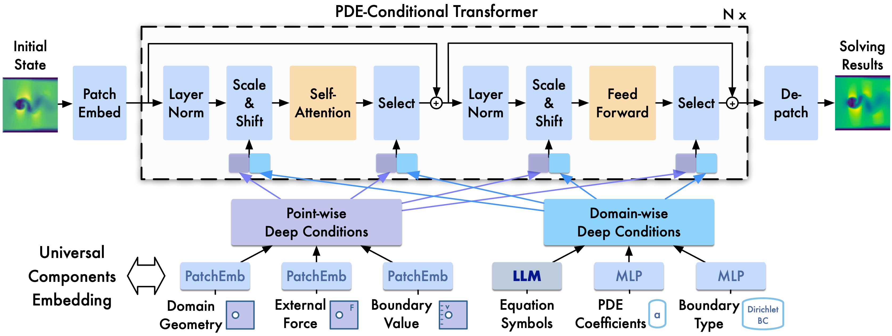
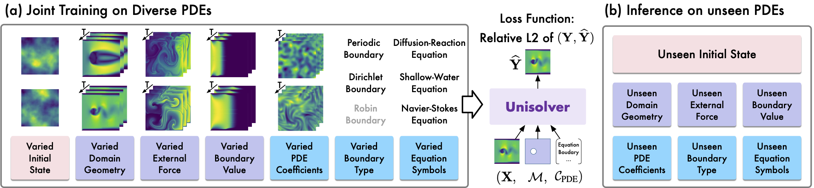
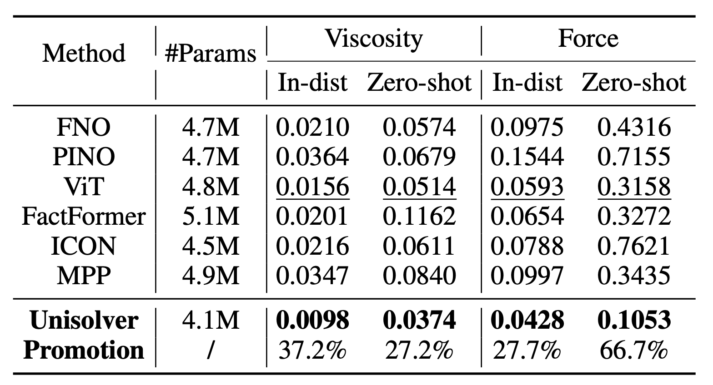
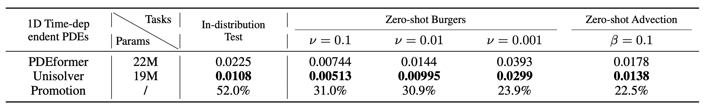
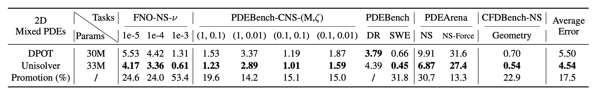

### Unisolver (ICML 2025)

Unisolver: Unisolver: PDE-Conditional Transformers Towards Universal Neural PDE Solvers

We introduce Unisolver, a PDE-conditional Transformer towards a <u>Uni</u>versal Neural PDE <u>solver</u>. Unisolver takes advantage from both data-driven and physics-informed paradigms and empowers Transformer with favorable generalizability bu introducing complete physics information as conditions.

- We introduce Unisolver as a conditional Transformer utilizing the embedded PDE information completely, marking the first demonstration of the canonical Transformer as a scalable backbone for solving multitudinous PDEs universally.
- Motivated by the mathematical structure of PDEs, we define the concept of complete PDE components, classify them into domain-wise and point-wise categories, and derive a decoupled conditioning mechanism for introducing physics information into PDE solving.
- Unisolver achieves consistent state-of-the-art performance on three challenging large-scale benchmarks.



<b>Figure 1</b>: Overview of Unisolver. We universally embed all PDE components, such as geometries, equation symbols and boundary conditions into deep conditions and employ a conditional Transformer to aggeregate deep conditions in decoupled subspaces.

### Problem setup of Universal Neural PDE solving



**Figure 2:** Overview of Universal PDE solving. Our model is jointly trained on diverse PDEs with varied initial conditions and governing PDE components, aiming for generalization to unseen PDEs in downstream PDE tasks.

### Results

Unisolver achieves remarkable results on three challenging large-scale datasets, covering a wide range of PDE components and both in-distribution test settings and zero-shot generalization settings.



<center><b>Table 1.</b> Results on HeterNS.</center>



<center><b>Table 2.</b> Results on 1D time-dependent PDEs.</center>



<center><b>Table 3.</b> Results on 2D mixed PDEs.</center>

### Citation

If you find this repo useful, please cite our paper.

```
@inproceedings{zhouunisolver,
  title={Unisolver: PDE-Conditional Transformers Towards Universal Neural PDE Solvers},
  author={Zhou, Hang and Ma, Yuezhou and Wu, Haixu and Wang, Haowen and Long, Mingsheng},
  booktitle={Forty-second International Conference on Machine Learning}
}
```

### Get started

Please refer to different folders to get detailed experiment instructions.

### Contact

If you have any questions or want to use the code, please contact zhou-h23@mails.tsinghua.edu.cn.